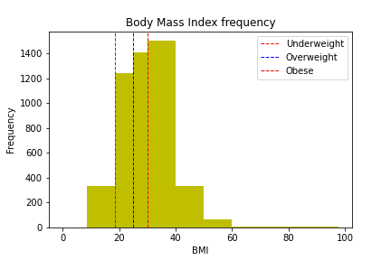

# Capstone Report

## Definition

### Project Overview

Stroke is an ailment affecting the normal blood supply to the brain. According to the [World Health Organisation](https://www.who.int/bulletin/volumes/94/9/16-181636/en/) stroke is the second leading cause of death globally, accounting for 10.2% of deaths in 2016.

Based on numbers of deaths alone, incidence appears to increase dramatically with age. A recent publication of the [International Journal of Scientific & Engineering Research](https://www.ijser.org/researchpaper/Stroke-Prediction-Models-A-Systematic-Review.pdf) outlines some existing models for cardiovascular risk assessment, which are used to predict strokes. There may be scope to improve on these using Machine Learning techniques.

I was personally drawn to this problem by a hunger to understand the affliction more deeply. Several people close to me have either passed away from a stroke, or are now living with a disability brought on as a result.

My Capstone Proposal is driven by the Stroke Prediction Dataset available on [Kaggle](https://www.kaggle.com/fedesoriano/stroke-prediction-dataset).

### Problem Statement

Train & deploy a Machine Learning model that can effectively & efficiently predict stroke incidence. Following this, determine what feature(s) may be causally related to strokes.

### Metrics

A crucial aspect of the final model's performance is its' ability to correctly predict instances of stroke (`stroke` = 1). Due to the imbalanced nature of the label values, accuracy will not be a good measure. Both precision and recall are useful when attempting to quantify the ability of a model to predict a single class. They are handily combined in to a single metric called F1 Score. See [this link](https://scikit-learn.org/stable/modules/generated/sklearn.metrics.f1_score.html) for more information on the algorithm in `scikit-learn`.

## Analysis

### Data Exploration

The dataset contains 5110 rows, each with 12 features and 1 label (`stroke`). Over 99% of rows have `stroke = 0` i.e. a stroke did not occur. One feature, `bmi`, has some null values which are taken care of.

### Exploratory Visualization

Here, the frequency of some BMI ranges are depicted in a bar chart. The generally accepted BMI thresholds are inlcuded ([see here for reference](https://www.nhlbi.nih.gov/health/educational/lose_wt/BMI/bmi_dis.htm)).

The most popular BMI bracket was 30 - 40. Armed with this knowledge, a relationship between obesity and stroke was investigated.

### Algorithms and Techniques

Algorithms and techniques used in the project are thoroughly discussed and properly justified based on the characteristics of the problem.

Insert final algorithms here.

### Benchmark

See [data_exploration.ipynb](data_exploration.ipynb) for a benchmark model. [Logistic Regression](https://scikit-learn.org/stable/modules/generated/sklearn.linear_model.LogisticRegression.html) was used, with the F1 score (more info below) algorithm testing its' effectiveness.

With the help of some Grid Search, the most effective model obtained had an F1 score of `0.2513`. This is quite a low score, that we should be able to beat with some further engineering. //!

Note that the dataset was not resampled for this benchmark; the only significant alteration of the underlying values was to replace null `bmi` values with the median.

Logistic Regression was chosen as a benchmark as it is regularly used for binary classification, and was very straightforward & simple to train and test.

## Methodology

### Data Preprocessing

All preprocessing steps have been clearly documented. Abnormalities or characteristics of the data or input that needed to be addressed have been corrected. If no data preprocessing is necessary, it has been clearly justified.

Split preprocessing into separate notebook.

Rebalancing required.

### Implementation

The process for which metrics, algorithms, and techniques were implemented with the given datasets or input data has been thoroughly documented. Complications that occurred during the coding process are discussed.

### Refinement

The process of improving upon the algorithms and techniques used is clearly documented. Both the initial and final solutions are reported, along with intermediate solutions, if necessary.

## Results

### Model Evaluation and Validation

The final model’s qualities—such as parameters—are evaluated in detail. Some type of analysis is used to validate the robustness of the model’s solution.

### Justification

The final results are compared to the benchmark result or threshold with some type of statistical analysis. Justification is made as to whether the final model and solution is significant enough to have adequately solved the problem.
